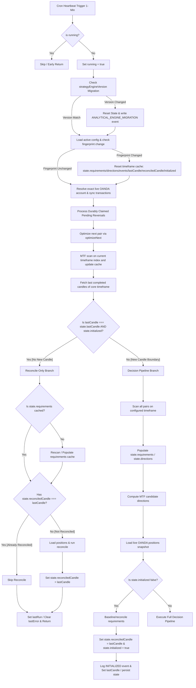
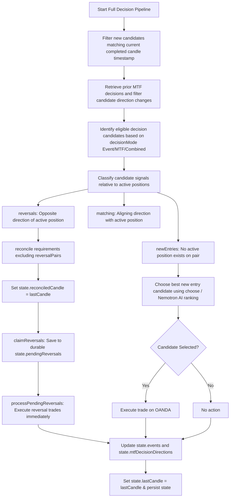

# CTE-Compound Tick Dispatch & Decision Pipeline Flow

This document details the core execution, housekeeping, and decision-making pipelines within the CTE-Compound analytical strategy engine.

---

## 1. Top-Level Dispatch Flow

The tick cycle starts from a 60-second cron heartbeat trigger, which invokes `tick()`. The workflow orchestrates state synchronization, optimization, multi-timeframe (MTF) pair scanning, and candles evaluation. It then routes into either the reconcile-only branch or the full decision pipeline branch.

---

## 2. Decision Pipeline Flow

When a new completed candle is identified, the decision pipeline classifies candle events and executes qualified reversals or new entry candidates.

---

## 3. Discrepancy Reconciliation & Deployment Layout

### 3.1. Deployment Manifest
The `cte-compound` Worker exposes specific edge bindings. Sibling workers on the account are out of scope, but the service bindings and Durable Objects exposed here are cataloged in `deploy-manifest.json`:
* **Service Binding**: `OANDA_ENGINE` binds `cte-compound` directly to our multi-pair scan execution process for concurrency and rate-limiting mitigation.
* **Durable Object Namespace**: `HTL_ENGINE` (class `HtlEngine`) maintains SQLite transactional persistence across ticks.
* **Workers AI**: Bindings to `AI` route text selection to `@cf/nvidia/nemotron-3-120b-a12b` and voice synthesis to `@cf/myshell-ai/melotts`.

### 3.2. Order Suppression Pathways (`NO_ORDER` Ledger Logs)
When candidate signals occur, order execution on OANDA is strictly gated. If execution is bypassed, a `NO_ORDER` entry is written to the ledger for inference and telemetry across **four (4) distinct paths**:
1. **No Margin Available**: If the live account NAV summary indicates `marginAvailable <= 0`, transaction dispatch is suppressed.
2. **Existing Position Matches Event**: If OANDA position alignment matches the computed signal direction, redundant transaction submissions are avoided.
3. **No Directional Units Available**: If market pricing or volume reports `unitsAvailable` is `0`, order submission is halted.
4. **Minimum-Units Threshold Violation**: If available trade size falls below `minimumUnits` preference configured in `uiPreferences`, order is suppressed.

### 3.3. Candidate Order Verification Subsystem (`__candidateTest`)
`cte-compound` exports a structured `__candidateTest` handler that exposes verification helpers:
* `normalizeCandidateOrder(candidate)`: Validates property formats.
* `verifyCandidate(candidate)`: Executes mathematical cross sanity check against original indicators.
* `calculationVersion` & `qualificationVersion`: Provides exact schema indicators for tracking strategy alignment.

---

## 4. Post-Mortem: Corrected Architectural Bugs

### Bug 1: Reconcile-Cadence Gate Mismatch (CSS/Execution Leak)
* **Problem**: Originally, `reconcile()` (the function responsible for closing opposing positions) fired on **every 60-second cron tick** when the candle was unchanged, instead of once per completed candle. This led to excessive redundant OANDA requests and premature/repeated position closures inside the same candle timeframe.
* **Fix**: Introduced `state.reconciledCandle` to gate execution. Reconciliation now evaluates and runs exactly once per completed candle across all three execution branches (Early return, Baseline Initialization, and New-Candle Processing), skipping subsequent cron heartbeat loops for the same candle.
* **Reconciliation Node Affected**: `O3` (Early Return Branch), `P6` (Baseline Branch), and `I` (Main Reversal/Entry Branch).

### Bug 2: Orphaning of Strategy-Version Migration / State-Reset
* **Problem**: The base engine (`engine.js`) defines state resetting/migration whenever `STRATEGY_ENGINE_VERSION` changes. However, `engine-certified-execution.js` fully overrides `tick()` without invoking `super.tick()` to avoid duplicate execution side-effects (e.g. doubling API queries and ledger writes). This bypassed the migration reset entirely, leading to stale events and directions persisting across upgrades, ultimately causing a deadlock where no new trades or reversals were ever evaluated ("won't open, won't reverse").
* **Fix**: Inlined the version-mismatch migration check at the very top of `tick()` inside `engine-certified-execution.js`. If a version mismatch is detected, it resets the events cache, directions, requirements, candle markers, and initialized state parameters before proceeding with strategy execution. It logs a one-time `ANALYTICAL_ENGINE_MIGRATION` event on the ledger.
* **Reset Node Affected**: `E` (Top-level dispatch housekeeping).
